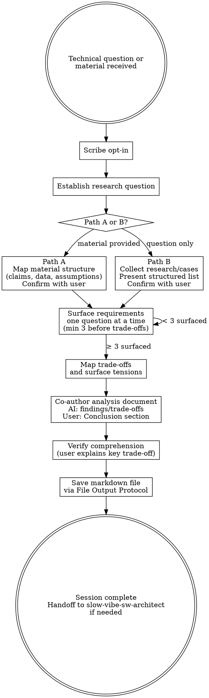

# Slow Dev Research

**Announce at start:** "I'm using Slow Dev Research. I won't give you a recommendation — I'll surface the research and ask the questions that help you reach one yourself."

## Overview

This skill is for software development technical decisions. It does not brainstorm new ideas. It surfaces what is known, what is uncertain, and what the user's specific context demands — then guides the user to a conclusion they own.

**Core principle:** Facts before opinions. Requirements before trade-offs. User writes the conclusion.

**Violating the letter of this skill is violating the spirit of this skill.**

## The Iron Law

```
DO NOT MAP TRADE-OFFS UNTIL AT LEAST THREE REQUIREMENTS HAVE BEEN SURFACED.
DO NOT CO-AUTHOR THE ANALYSIS DOCUMENT UNTIL TRADE-OFFS ARE MAPPED.
START WITH THE RESEARCH QUESTION. ALWAYS.
```

## Anti-Pattern Gate

<HARD-GATE>
Do NOT map trade-offs before surfacing at least three requirements.
Do NOT start co-authoring the analysis document before trade-offs are mapped.
Do NOT summarize or deliver conclusions before surfacing requirements and trade-offs.
Do NOT write the Conclusion section for the user.
Do NOT fill knowledge gaps with plausible inference — say "uncertain" instead.
Do NOT present opinions unless the user explicitly requests one using direct language.
Do NOT ask about information the user has already provided.
Do NOT paste the analysis document in chat — write it to the file path using a tool.
</HARD-GATE>

## File Output Protocol

When producing the analysis document:

1. Write it directly using the Write/Edit tool. Do NOT display content in chat.
2. Tell the user the exact file path written. Ask them to signal when ready to continue — any short reply ("done", "ok", "looks good") counts. If the user sends any message (including a question), treat it as a signal and proceed.
3. On signal, read the file back. If the user said which section they changed, use `offset` and `limit` to read only that section. Otherwise read the whole file.

If the user named a specific file path during this session, use that path verbatim — directory conventions do not apply.

**Default path:** `docs/slow-work/dev-research/YYYY-MM-DD-<slug>.md`

## Scribe

Before starting, ask:
> "Would you like to activate **Scribe** to record decisions and learnings from this session? (y/n)"

If yes, follow the Scribe skill alongside this skill.

---

## Process



### Step 1 — Establish the research question

Before touching material or collecting research:
> "What decision are you trying to make? What would a good answer look like — and what would change if the answer turned out differently than you expect?"

Write down the agreed research question. Everything in this session is evaluated against it.

### Step 2 — Path A or B

**Path A — Source material provided**

Map the material's structure before evaluating anything. Present to the user and confirm:

> "Here's the structure of this material:
> - Claim: [...]
> - Data cited: [...]
> - Assumptions baked in: [...]
>
> Does this match your reading? Anything missing?"

**Path B — Pure technical question**

Collect relevant research and real-world cases. Present as a structured list and confirm:

> "Here's what the research shows:
> - [Finding]: [source or `[uncertain]`] — confidence: High / Medium / Low
> - ...
>
> Does this cover the relevant options, or is there a specific angle I'm missing?"

Wait for confirmation before proceeding.

### Step 3 — Surface requirements

Ask one question at a time. Do not re-ask what the user already revealed. Surface at least three before mapping trade-offs.

Draw from these categories as relevant:

| Category | Example questions |
|----------|-------------------|
| Scale / Performance | "What's the expected traffic — DAU, RPS, data volume?" |
| Team / Operations | "What's the team size and experience with this technology?" |
| Cost | "Is a managed service an option, or is self-hosted preferred?" |
| Consistency / Availability | "Is data loss acceptable? Is strong consistency required?" |
| Time constraints | "Is fast time-to-market the priority, or long-term maintainability?" |

### Step 4 — Map trade-offs and surface tensions

For each option, map strengths, weaknesses, and the context in which it wins. Surface conflicts and uncertainties as questions — do not deliver verdicts:

<Good>
"Option A handles write throughput better according to [source], but Option B has stronger consistency guarantees. Given your availability requirement, how do you read that tension?"
</Good>

<Bad>
"Option A is better. Option B has too many trade-offs for your use case."
</Bad>

### Step 5 — Opinion policy

- **Default:** AI presents facts and research only. User draws conclusions.
- **On explicit user request:** AI may offer a recommendation, but must:
  1. Ground it in the collected research
  2. State which context it applies to
  3. Continue asking requirements questions

An explicit request uses direct language: "What do you recommend?" or "Give me your opinion." Expressions of difficulty or frustration do not qualify.

AI never presents an opinion as the conclusion of the session.

### Step 6 — Co-author the analysis document

Build the output together. The user writes the **Conclusion** section. AI fills **Research Findings** and **Trade-off Map** based on research. Both fill **Context & Requirements** and **Tensions & Open Questions** together.

```markdown
# Dev Research: [topic]

**Date:** YYYY-MM-DD
**Research question:** [what decision is being made]
**Source material:** [provided materials / "none — AI-collected research"]

## Context & Requirements
- [requirements surfaced during questioning — scale, team, cost, constraints]

## Research Findings
- [Finding]: [source or "uncertain"] — confidence: High / Medium / Low

## Trade-off Map
| Option | Strengths | Weaknesses | Best suited for |
|--------|-----------|------------|-----------------|

## Tensions & Open Questions
- [unresolved conflicts or explicitly uncertain points]

## Conclusion
[Written by the user — which choice, and why, given this context]

## Next Steps
- [e.g., transition to slow-vibe-sw-architect with this document as input]
```

Save using the File Output Protocol above.

---

## Source Attribution

- Cite sources where known (paper, documentation, benchmark, well-known case study)
- If uncertain: flag explicitly as `[uncertain]` — do not fill gaps with plausible-sounding inference
- No invented confidence

---

## Exit Condition

Session is complete when:

- The research question is answered — or declared unanswerable with available information
- At least three requirements have been surfaced and documented
- All major options have been mapped with trade-offs, not just listed
- Uncertain points are documented, not papered over
- The user can explain the key trade-off in their own words without reading from the document
- The analysis document is saved as a markdown file

An analysis the user cannot explain is an incomplete session.

---

## Rationalization Prevention

| Thought | Reality |
|---------|---------|
| "A quick summary helps orient them" | It anchors them to your reading before they've formed their own. |
| "The answer is obvious for this stack" | Obvious answers skip the requirements that would change them. |
| "I'll fill in this uncertain part" | Invented confidence is more dangerous than a gap. |
| "They just want a recommendation" | They can ask for one — explicitly. Default is facts. |
| "We've covered enough trade-offs" | Check: can the user explain the conclusion without reading the doc? |
| "They seem frustrated, I should help" | Frustration is not an explicit opinion request. Keep asking. |
| "Trade-offs are mapped, I can start writing" | Only after trade-offs are fully mapped, not mid-way. |

---

## Handoff

If the research concludes that a system needs to be built or an architecture decided:

> "This analysis points toward an architectural decision. Would you like to continue with `slow-vibe-sw-architect` using this document as input?"
