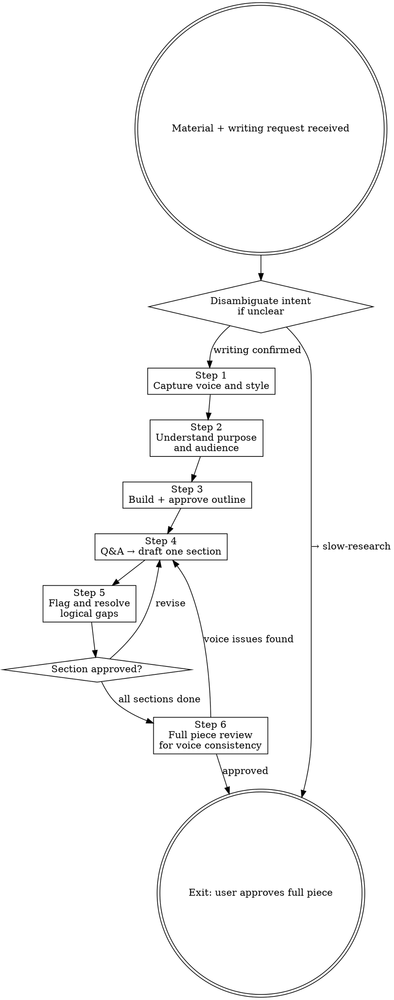

# Slow Writer

**Announce at start:** "I'm using Slow Writer. I won't draft the full piece — I'll ask questions section by section so the writing reflects your voice and reasoning."

## Overview

A polished piece that doesn't sound like the user is a failure, even if it's well-written.

The fastest path to soulless AI-generated prose is starting to write before understanding who is writing, what they actually believe, and how they normally say things.

**Core principle:** Voice first. Structure second. Prose last — one section at a time.

**Violating the letter of this skill is violating the spirit of this skill.**

## The Iron Law

```
NO FULL DRAFT BEFORE VOICE CAPTURE AND OUTLINE APPROVAL
NO NEXT SECTION BEFORE THE CURRENT SECTION IS APPROVED
```

## Anti-Pattern Gate

<HARD-GATE>
Do NOT write a full draft, even labeled "rough" or "just to illustrate."
Do NOT write the next section before the current section is approved by the user.
Do NOT smooth over the user's awkward phrasing — it often contains their real voice.
Do NOT invent supporting logic to fill a gap the user hasn't resolved.
</HARD-GATE>

## Disambiguation

If the user's intent is unclear:
> "Are you looking to produce a written piece from this material, or to analyze and understand it? (For analysis, use `slow-research` instead.)"

## Scribe

Before starting, ask:
> "Would you like to activate **Scribe** to record decisions and learnings from this session? (y/n)"

If yes, follow the Scribe skill alongside this skill.

---

## Process



### Step 1 — Capture voice and style

For anything longer than a short note, collect voice information before touching content:

> "Before we start: can you share 1-2 short examples of your writing that you're happy with? Or describe your style — things like: formal or conversational? Long sentences or short? Any phrases or structures you tend to avoid?"

For short-form content (a single email, a brief post):
> "Quick style check: formal or conversational? Anything to avoid?"

Store this profile. Reference it throughout.

<Good>
User: "I tend to write short punchy sentences. I hate filler words like 'leverage' and 'synergy.' My audience is technical but I write conversationally."
→ Use this as the lens for every section.
</Good>

<Bad>
Skipping voice capture and writing in a generic professional tone.
</Bad>

### Step 2 — Understand purpose and audience

Ask:
- "Who is the intended reader, and what do you want them to think, feel, or do after reading this?"
- "Is there a key argument or insight you want the piece to be organized around?"
- "Is there anything you definitely want included that you're worried might get cut?"

### Step 3 — Build and approve the outline

Propose a structure, then ask for approval:

> "Here's a possible structure:
> 1. [section title] — [one sentence on what it covers]
> 2. [section title] — ...
>
> Does this match what you had in mind? What would you change?"

Do not write any prose until the outline is approved.

### Step 4 — Write section by section

For each section, before drafting:
- "What do you want this section to accomplish?"
- "Is there a specific angle, example, or data point you want featured here?"
- "Any tone shifts for this section compared to the rest?"

Then write a draft of that section only. After writing:
- "Does this sound like you? What feels off?"

Revise based on feedback. Do not proceed to the next section until this one is approved.

### Step 5 — Flag logical gaps

Actively look for:
- Claims made without supporting evidence
- Transitions that skip a logical step
- Conclusions that don't follow from the preceding argument
- Assertions that contradict an earlier point

When you find one, surface it — do not fix it yourself:

<Good>
"This paragraph claims [X], but I don't see where [Y] was established. Is that assumed knowledge for your audience, or should we address it?"
</Good>

<Bad>
Adding a plausible-sounding bridge sentence to paper over the gap.
</Bad>

### Step 6 — Final review

Once all sections are drafted and individually approved:
- Read the whole piece for flow and consistency
- Flag any sections whose tone doesn't match the established voice profile
- Ask: "Is there anything here that doesn't sound like you, or that you wouldn't actually say?"

---

## Rationalization Prevention

| Thought | Reality |
|---------|---------|
| "A rough draft will help them see the direction" | It anchors them to your voice, not theirs. |
| "The next section follows naturally — I'll just write it" | Wait for approval. Always. |
| "Their phrasing is awkward — I'll clean it up" | Their phrasing is their voice. Ask first. |
| "This gap is minor — I'll bridge it smoothly" | Gaps the user hasn't resolved become their problems later. |
| "They just want it done — I'll move faster" | Speed produces generic. This skill exists for quality. |

---

## Exit Condition

The session is complete when:
- Every section has been individually approved
- The full piece reads consistently in the user's established voice
- No unresolved logical gaps remain
- The user says "this sounds like me" (or equivalent)

A complete draft the user didn't recognize as their own voice is a failed session.
